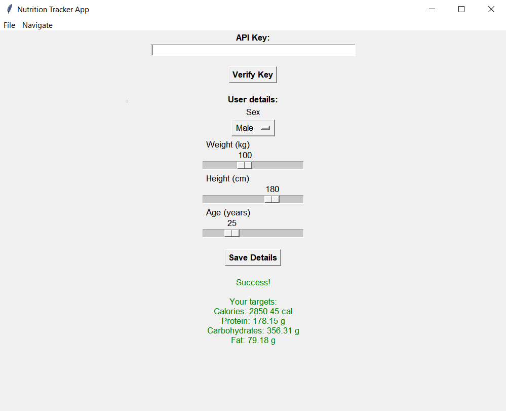
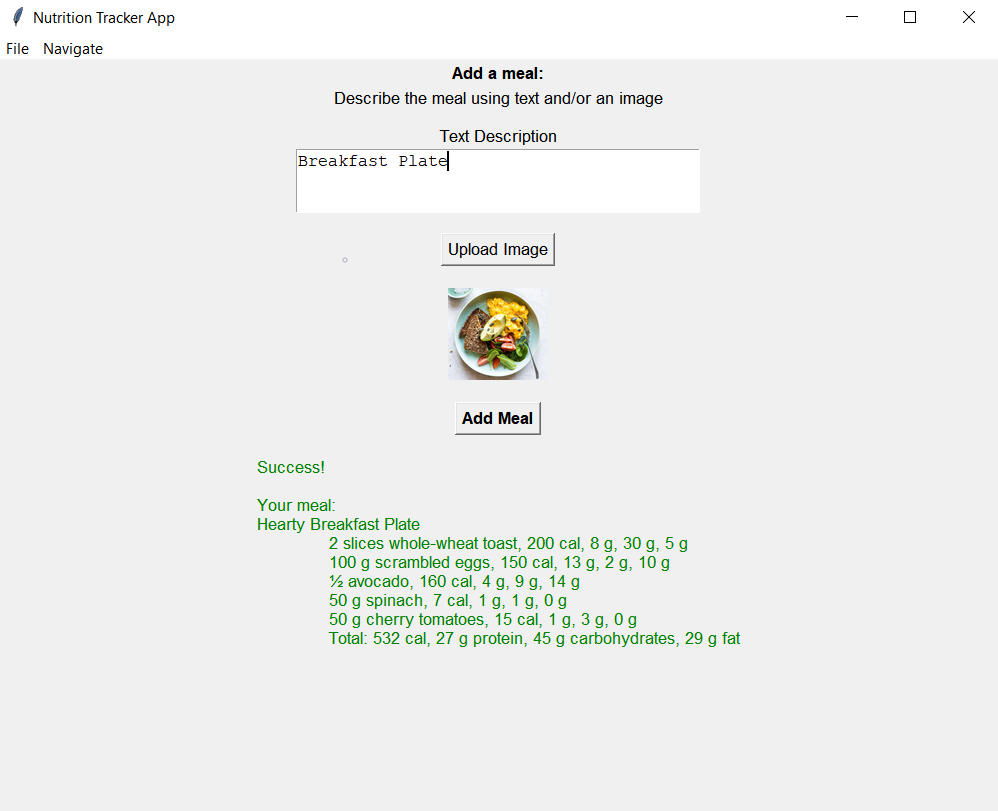
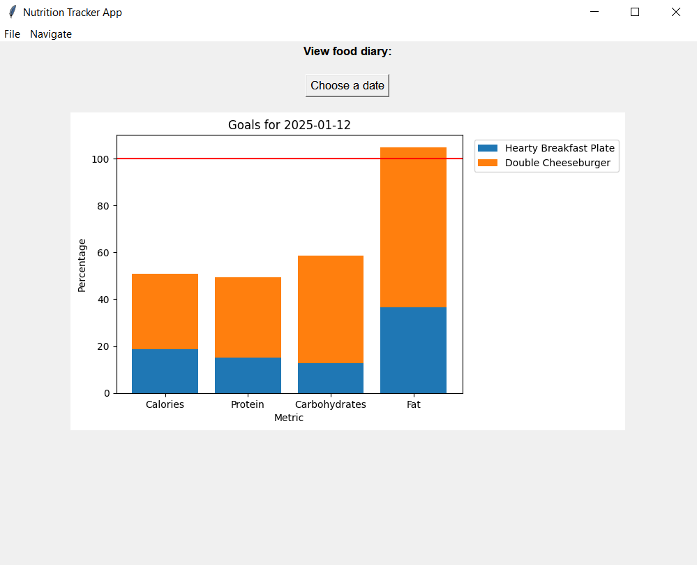
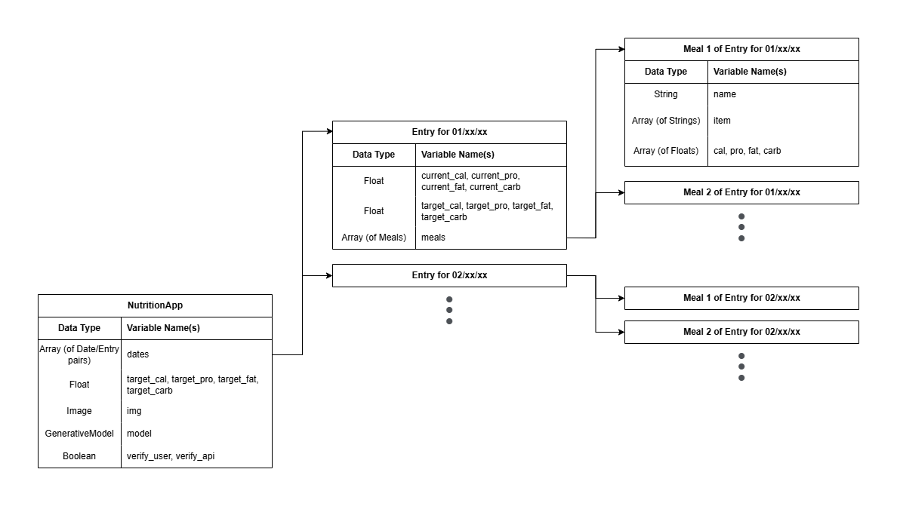
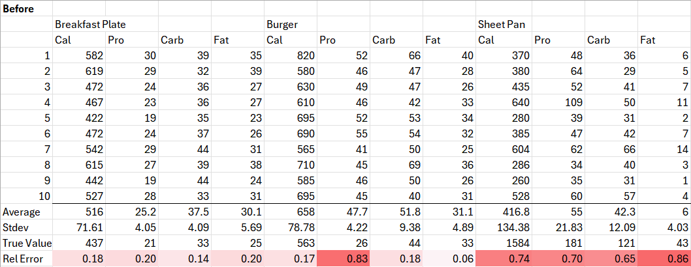
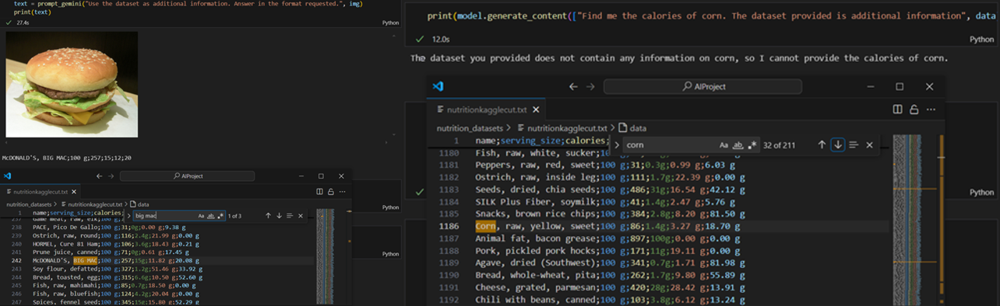
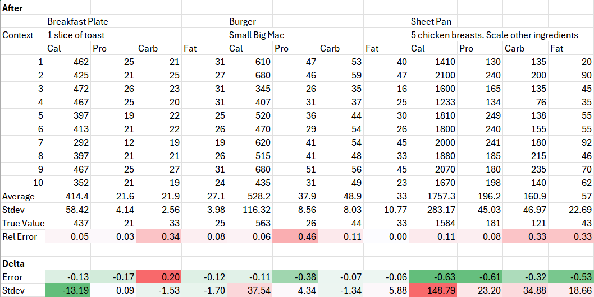

# Nutrition Tracker
**Author**: jjadey

## Purpose
### Problem
When it comes to improving health and fitness, exercise often takes the spotlight. However, it is important to remember that factors outside of the gym, such as diet, play an equally significant role.

- For losing weight, reducing calorie intake is much easier than burning calories through exercise.
- For building muscle, a slight calorie surplus coupled with plenty of protein is ideal.

Considering this, it is important to monitor nutrition precisely and meticulously. However, even seasoned athletes can find it challenging to track meals consistently.

### Solution
To make nutrition tracking easier, I have created an app which integrates recent developments in AI to remove some of the burden from the user.

Instead of having to measure and log every single ingredient, the user can simply take a photo or write a short description of the entire meal and let the AI do the calculations.

## Setup
1. **Install Application**: Download and run `NutritionTracker.exe` from this repository.
2. **Get API Key**: Go [here](https://aistudio.google.com/app/apikey) to get a Google Gemini API key.\
*This is free, as long as you do not set up billing.*
3. **Verify API Key**: Either paste the API Key into the "API Key" text box on the settings page, or into a system environment variable called `GEMINI_API_KEY`. Click the "Verify Key" button.\
*Please be patient, it is normal for the application to hang during this process.*

## Usage

||||
|---|---|---|

Use the menu bar to navigate to the different pages:
1. **Settings**: Enter your sex, weight, height, and age, height, and weight. Click the "Save Details" button to generate your target calories and macronutrients.
2. **Log Meal**: Enter a description and/or image of your meal. Click the "Add Meal" button to generate nutritional information and add the meal to your diary.
3. **View Diary**: Choose a date to view your progress towards your daily goals.

## Design
### Alternatives (Market Research)
The most popular nutrition tracker at the moment is [MyFitnessPal](https://www.myfitnesspal.com). This is a free mobile app released in 2005, which has an optional premium subscription.

**Pros**:
- Well-designed interface: The app is streamlined and provides a pleasant user experience. The app looks visually appealing, rarely freezes, and is easy to navigate.
- Large database: The app is linked to a database containing millions of foods. Foods can be added by the community, and verified to ensure the information is accurate.

**Cons**:
- Premium features: Many useful features such as macronutrient tracking and barcode scanning of manufactured food products, are locked behind a paid subscription. As of writing, this costs 20 USD/month or 80 USD/year.
- Time-consuming: To log a meal, each of its ingredients must be individually logged. While MyFitnessPal makes this easier by allowing the user to save their favourite meals, the app does not have the ability to infer ingredients from a picture or description.

### AI
My initial search focused on looking for AI models which provide API services and are well-established with comprehensive documentation and strong community support. This led me to OpenAI's ChatGPT and Google's Gemini.

I ultimately chose Gemini because it offers a free tier, whereas ChatGPT only offers a free trial which has since been discontinued. Additionally, I already have a Google account and have experience using Gemini, whereas creating an OpenAI account requires a phone number, which I prefer not to provide for privacy reasons.

### Data Structures

*Diagram of Data Structures*

Since nutrition is generally tracked on a daily basis, I created a class called `Entry` to store all of the data pertaining to a single day. This data consists of the targets, and the progress towards them, as floats. This allows a user's targets to change as their body changes, without changing records that have already been created.

The `Entry` class also stores meal data. This is done through another class, called `Meal`. The data stored in the `Meal` class consists of the name of the meal, as a string, but also a series of arrays which store ingredient data. Arrays were used because it is easy to sum all the elements in an array (e.g. to get the total calories of all ingredients), and it is easy to navigate using indices (to lookup data for a certain ingredient).

This approach also requires prompting Gemini to give the nutrition of each ingredient separately but has the benefit of allowing the user to see where their nutrients are coming from.

### Prompt Engineering
While developing other areas of the application, I observed some consistent inaccuracies in Gemini's nutritional estimations. Notably:

- Recognizing the scale of photos, likely due to a lack of depth and contextual information
- Processed foods, possibly due to the ambiguity of determining the ingredients (as opposed to meals that consists of whole foods).

To quantify these issues, I collected a sample of data by running the same prompt ten times, for three different prompts. It is clear that Gemini's responses are not deterministic.

*Before Prompt Engineering*

At first, I explored the idea of linking Gemini to an ingredient database, so that the data used would be more consistent. I attempted to ask Gemini to "Prioritise nutritional data from https://fdc.nal.usda.gov" (USDA database), but this did not make any noticeable difference. Unlike Gemini's web interface, the API appears to have more limitations, including being trained on older data and not being able to use a search engine to read links.

To get around this, I also attempted to upload csv, txt, and pdf versions of the database upload csv, text, and pdf files of databases for the database to use. However, not only was the model inconsistent at accessing data, it also significantly increased the response time from around 3-5 seconds to 1-2 minutes.

*Model Inconsistency when Accessing Data*

Having found little success, I decided to pursue other avenues. Upon re-evaluation of the data, I observed that averages tend to be quite accurate, and that it might be feasible to prompt Gemini several times and take the average of its responses. A limitation of this approach is that while it would not work well for individual ingredients since Gemini is not consistent with the ingredient list.

Another option would be to allow the user to regenerate responses, or to challenge the AI (using a "chat" instead of a "prompt") when they notice something is wrong. For example, in a photo with fried chicken, I could see five pieces but Gemini could only identify four. While potentially effective, the problem with this method is that it would require the user to identify issues, which defeats the app's purpose of being beginner friendly.

The solution I settled on, was to allow users to provide additional context alongside or instead of an image. Running the tests again with simple contextual descriptions to showed significant improvement in accuracy.

*After Prompt Engineering*

To quantify the overall improvement, mean absolute error (MAE) was calculated across all 120 nutritional estimates (10 generations × 3 meals × 4 nutritional attributes). The introduction of contextual information reduced overall MAE from 136.34 to 48.42, representing a 64% reduction in MAE.

### UI
This involved a decision between creating a GUI using a package such as Tkinter or creating a web application using a package such as Flask. Considering the sensitive nature of user data and API keys, I opted for Tkinter so that the application runs locally on each user's machine.

As for developing the GUI itself, I focused on making the UI as friendly as possible by using bold fonts to highlight titles and key buttons, as well as using green and red colours to signify success and error messages.

### Future
This app is designed so that the model is well-encapsulated from the rest of the backend and should be easy to swap if a more advanced/trained model is developed in the future. Possible techniques that could be explored are function calling and fine tuning. For this purpose, the [Nutrition5k dataset](https://github.com/google-research-datasets/Nutrition5k) might prove useful.